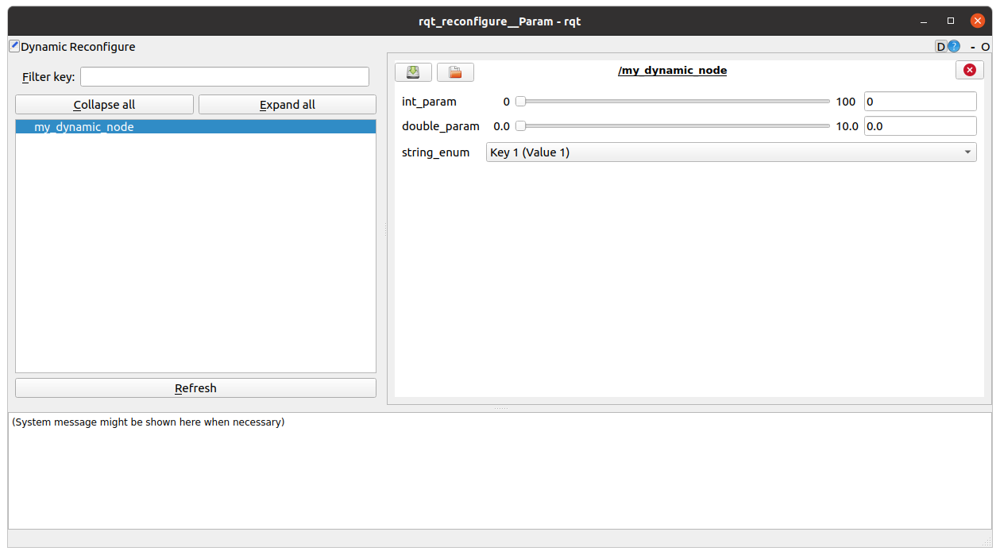

# my_ddynamic_package (ddynamic_reconfigure)
The [ddynamic_reconfigure](https://github.com/pal-robotics/ddynamic_reconfigure) package is a C++ extension of dynamic_reconfigure that allows modifying parameters of a ROS node using the [dynamic_reconfigure](https://github.com/ros/dynamic_reconfigure) framework without having to write cfg files.

## Install
```
sudo apt-get install ros-$ROS_DISTRO-ddynamic_reconfigure
sudo apt-get install ros-$ROS_DISTRO-rqt-reconfigure
```

## Usage
### Condition
This package requires at least C++11. If you have cmake version at least 3.1 the easiest way to do it is: ```set (CMAKE_CXX_STANDARD 11)```

### Write Code
When you write nodehandle, you have to use private nodehandle ```ros::NodeHandle nhp(namespace)```

### Execute
**Terminal 1:**

```bash
roslaunch my_ddynamic_package my_ddynamic_package.launch
```

``` bash
rosrun rqt_reconfigure rqt_reconfigure
```


## Example

